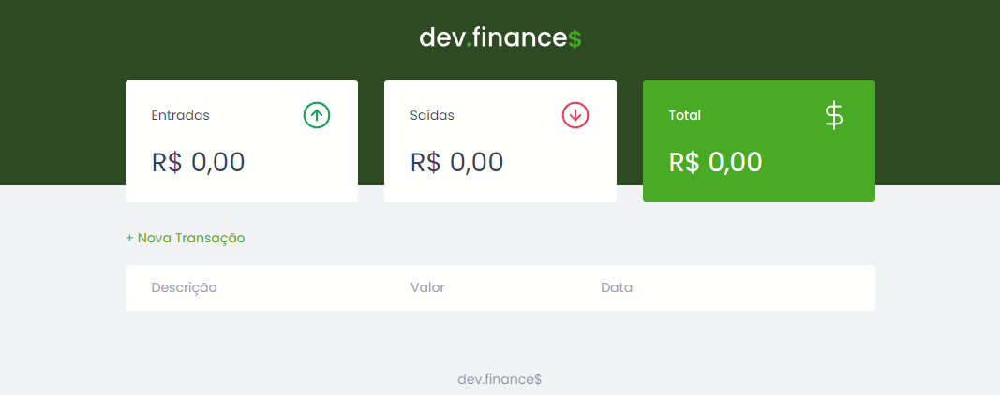
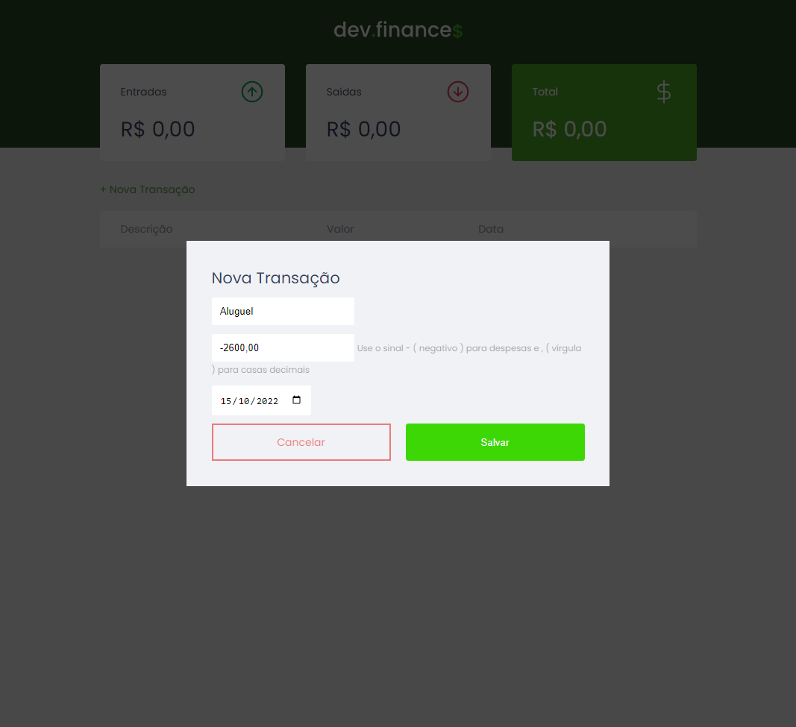
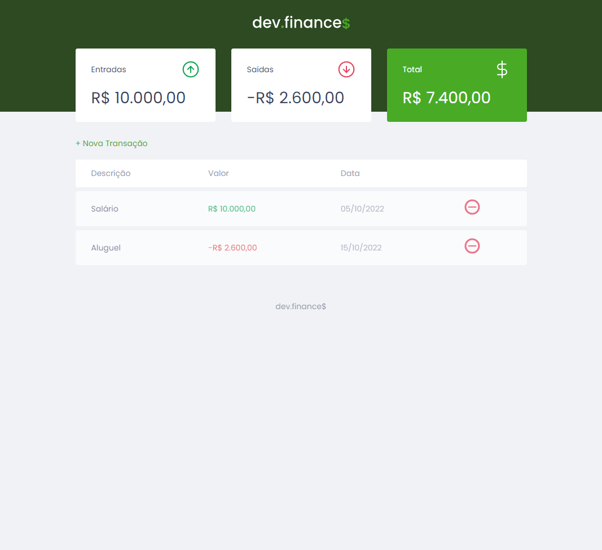

> # DEV.FINANCE$

> ### 🔗 [Você pode ver o projeto aqui.](https://marianecrt.github.io/dev_finances/)

### Aplicação desenvolvida na maratona discover 01 com o professor Mayk Brito, da Rocketseat, com o objetivo de por em prática os conhecimentos adquiridos nos cursos do primeiro módulo do Discover.

### Foram aplicados conceitos como:

- Local storage do navegador;
- Arrow function;
- DOM;
- Formulários;
- Responsividade;
- innerHTML;

### A aplicação consiste em um controle de finanças. Podem ser adicionadas transações pelo botão "+ Nova Transação" que abrirá um pequeno formulário para ser preenchido com as informações da transação.

### Depois de preencher os campos basta clicar no botão "Salvar" para adicionar a nova transação, ou "Cancelar", isso irá cancelar as informações preenchidas e fechará o modal. Os resultados já serão exibidos automaticamente nos cards do balanço na parte superior.

> ## 🛠 Tecnologias

- HTML e CSS;
- Javascript;
- Git

> ## 👋🏼 Contatos

- marianectrodrigues@gmail.com
- [Linkedin](https://www.linkedin.com/in/marianectrodrigues/)
